## Table of Contents

<ul>
    <li><a href="#abstract">Abstract</a></li>
    <li><a href="#feature-models">Feature Models</a></li>
    <li>
        <a href="#research-questions">Research Questions</a>
      <!-- <ul>
        <li><a href="#sub-heading-1">RQ1: Sanity Check</a></li>
        <li><a href="#sub-heading-2">RQ2: Comparing COR-NSGA-II to MOEAs and MaOEAs</a></li>
        <li><a href="#sub-heading-2">RQ3: Evaluating the Solutions</a></li>
      </ul> -->
    </li>
    <li><a href="#questionnaires">Questionnaires</a></li>
</ul>

## Abstract

**Context:** Multi- and many-evolutionary algorithms have been applied to derive products for the variability testing of Software Product Lines (SPLs). This problem refers to the selection of an adequate product set to test a SPL by optimizing some objectives related to the number of products to be tested, testing criteria to be satisfied, and revealed faults. However, some problems emerge when the number of objectives to be optimized increases, for example: the solutions generated by the optimization algorithms become incomparable, designing a Pareto-front in this context requires a large number of solutions, and the visualization of such solutions requires special techniques. Several techniques are proposed to tackle this problem, such as decomposition and algorithms based on indicators. Among them, algorithms based on dimensionality reduction and user preferences are widely used, but there are no studies in the literature investigating the usage of both in a combined way. 
    
**Objective:** In light of this, we introduce COR-NSGA-II (Confidence-based Objective Reduction NSGA-II). COR-NSGA-II defines for each objective a confidence-level calculated with the user preferences provided interactively. The objectives with higher values of confidence are removed from the next algorithm execution. 
    
**Method:** For assessing the feasibility of COR-NSGA-II, experiments were conducted by using six different SPLs, seven objectives, two types of reference points representing the user preferences, and two scenarios to simulate different user profiles. 

**Results:** COR-NSGA-II is evaluated against 4 algorithms explored in the literature for the problem, and outperforms most of them according to R-HV and R-IGD. It takes less time to execute and generates a reduced number of solutions, all of them satisfying the user preferences. 

**Conclusion:** A qualitative analysis performed with 12 potential users shows that the task of selecting a solution generated by COR-NSGA-II is easier than selecting a solution generated by the other algorithms.

## Feature Models

Thes are the charateristics of the FMs used in the experiments.

| FM | Nt | n | AM | VP | # of Features |
|:---:|:---:|:---:|:---:|:---:|:---:|
James [31] | 68 | 68 | 106 | 75 |  14 | 
CAS [32] | 450 | 450 | 227 | 183 |  21 | 
WS [33] | 504 | 504 | 357 | 195 |  22 | 
E-Shop [34] | 1152 | 1152 | 94 | 202 |  22 | 
Drupal [34] | ~2.09E9  | 11k | 2194 | 1081 | 48 | 
Smarthome [6] | ~3.87E9 | 11k | 2948 | 1710 | 60 | 

The following shows the FMs.

|   | 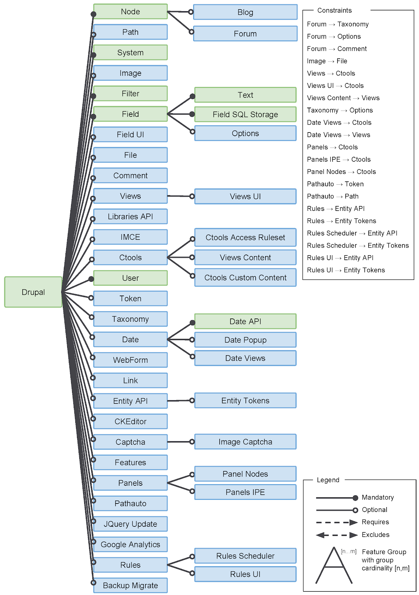  | 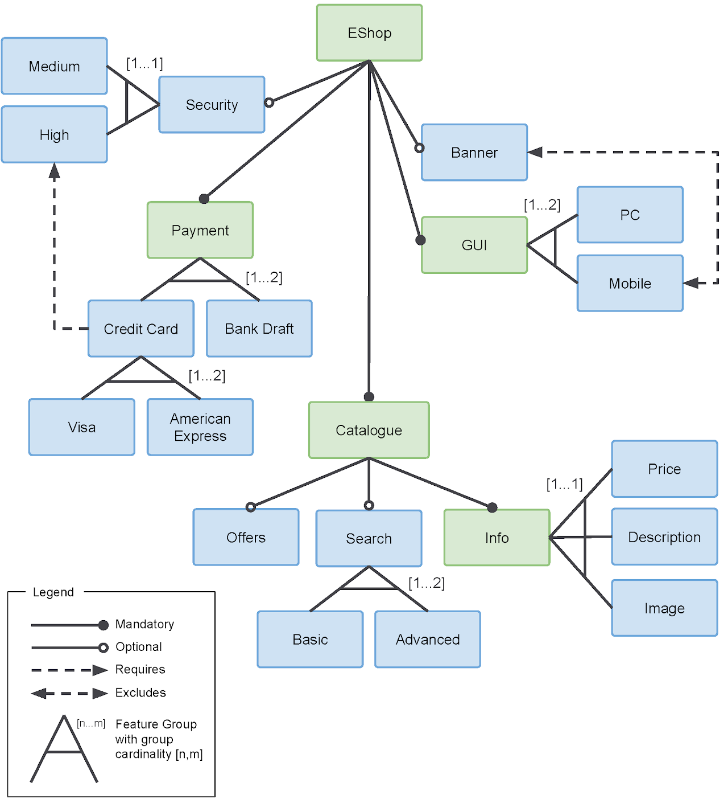  |
|:---:|:---:|:---:|
| CAS | Drupal | EShop |

| 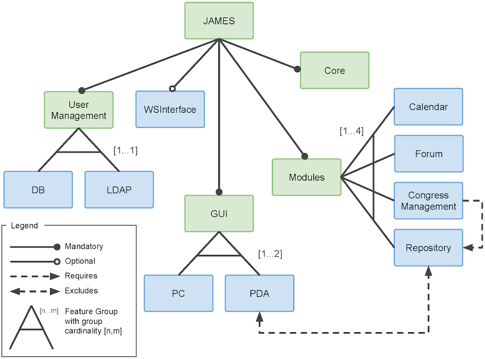  | 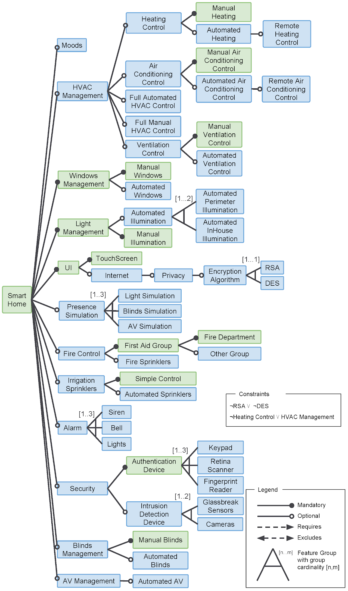  | 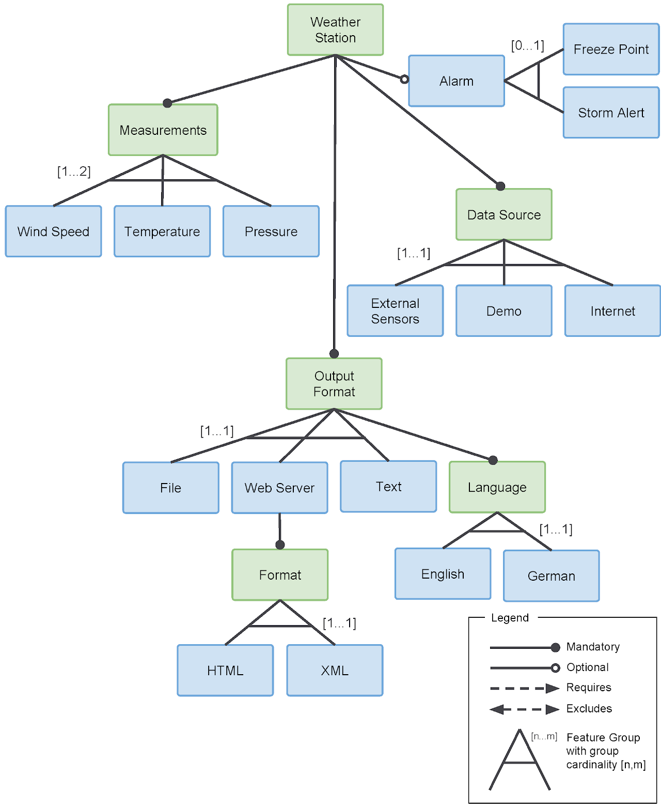  |
|:---:|:---:|:---:|
| James | Smarthome | WS |

## Research Questions

### RQ1: Sanity Check

| 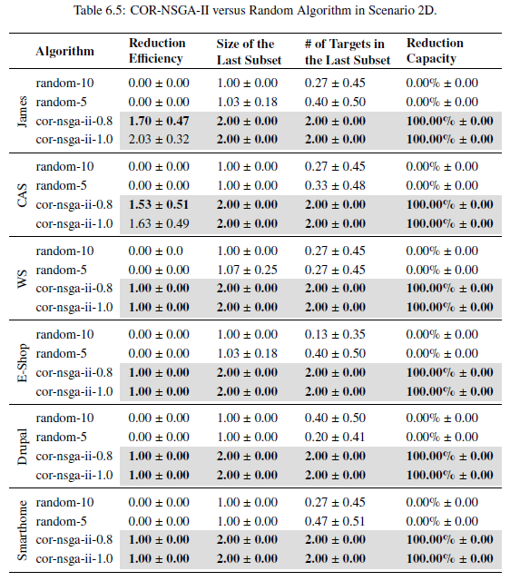  | 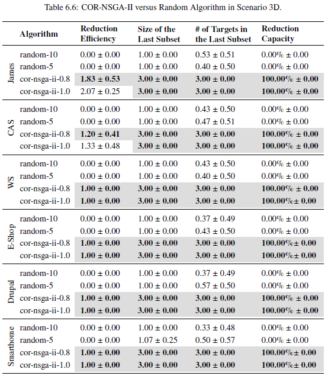 |
|:---:|:---:|
| | |

### RQ2: Comparing COR-NSGA-II to MOEAs and MaOEAs

| 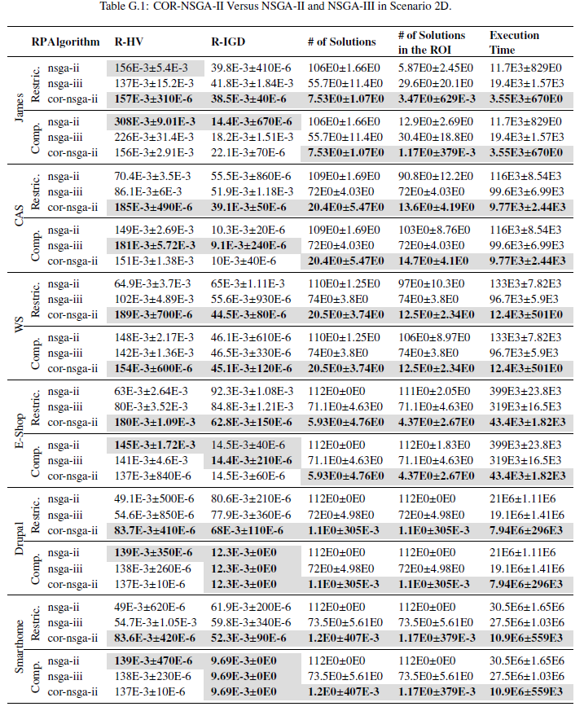  | 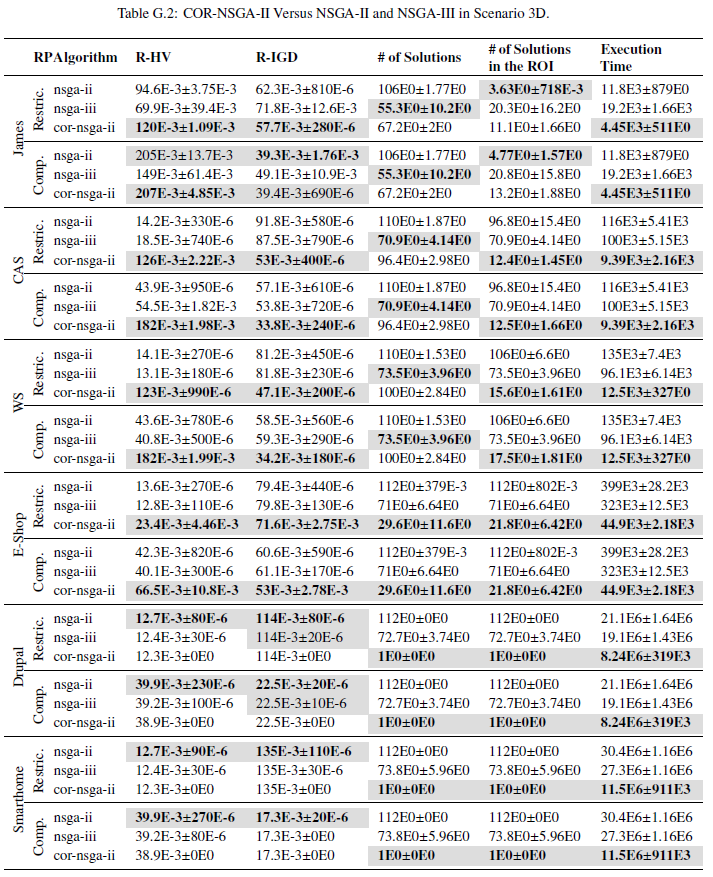 |
|:---:|:---:|
| | |

| 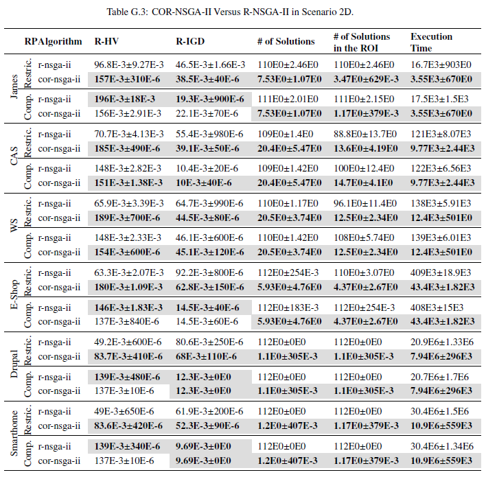  | 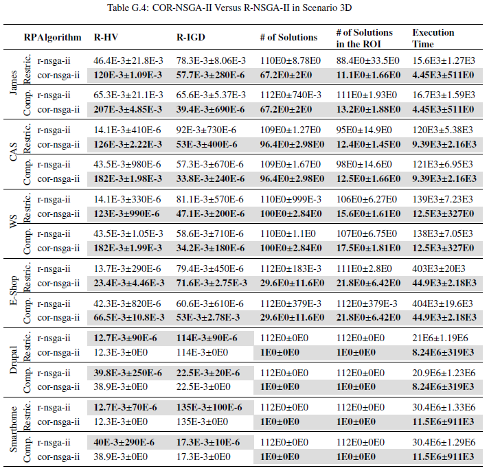 |
|:---:|:---:|
| | |

|   |  |
|:---:|:---:|
| | |

### RQ3: Evaluating the Solutions

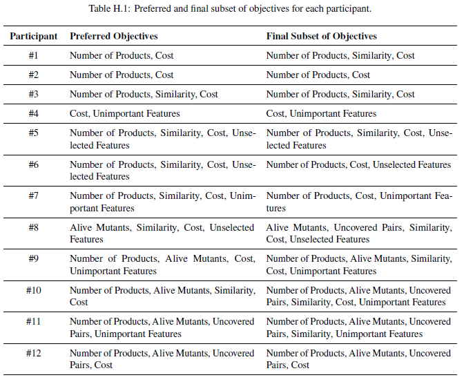

## Questionnaires

 - [Algorithms Questionnaire](./questionnaires/Algorithms Questionnaire.pdf)
 - [Participants Questionnaire](./questionnaires/Participants Questionnaire.pdf)
 - [Pre-study Questionnaire](./questionnaires/Pre-study Questionnaire.pdf)

