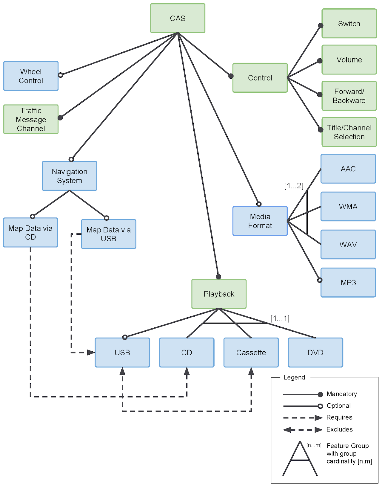

## Table of Contents

<ul>
    <li><a href="#abstract">Abstract</a></li>
    <li><a href="#feature-models">Feature Models</a></li>
    <li>
        <a href="#research-questions">Research Questions</a>
      <ul>
        <li><a href="#sub-heading-1">RQ1: Sanity Check</a></li>
        <li><a href="#sub-heading-2">RQ2: Comparing COR-NSGA-II to MOEAs and MaOEAs</a></li>
        <li><a href="#sub-heading-2">RQ3: Evaluating the Solutions</a></li>
      </ul>
    </li>
    <li><a href="#questionnaires">Questionnaires</a></li>
</ul>

## Abstract

Multi- and Many-Evolutionary Algorithms have been applied to derive products for the variability testing of Software Product Lines (SPLs). This problem refers to the selection of an adequate set of products to test a SPL by optimizing some objectives related to the number of products to be tested, testing criteria to be satisfied, and efficacy to reveal faults. However, some problems emerge when the number of objectives to be optimized increases, for example: the solutions generated by the optimization algorithms become incomparable, designing a Pareto-front in this context requires a large number of solutions, and the visualization of such solutions requires special techniques. Several techniques are proposed in the literature to tackle this problem, such as decomposition and algorithms based on indicators. Among them, the algorithms based on dimensionality reduction and algorithms based on the user preferences are widely used. Even though used in different approaches, there are no studies in the literature that investigate the usage of dimensionality reduction and preference-based algorithms in a combined way. In light of this, we introduce COR-NSGA-II (Confidence-based Objective Reduction NSGA-II). COR-NSGA-II defines for each objective function a confidence-level calculated with the user preferences provided interactively. The objectives with higher values of confidence are removed from the next algorithm execution. For assessing the feasibility of COR-NSGA-II, experiments were conducted by using six different SPLs, seven objectives, two types of reference points representing the user preferences, and two scenarios to simulate different user profiles. COR-NSGA-II is evaluated against four algorithms explored in the literature for the problem. It outperforms most of them, taking less time to execute and generating a lower number of solutions but that satisfy the user preferences. A qualitative analysis performed with a set of 12 potential users shows that for them, the task of selecting a solution generated by COR-NSGA-II is easier than to select a solution generated by other algorithms.

## Feature Models

| [cas](./images/fm-cas.png)  | [cas](./images/fm-cas.png)  | [cas](./images/fm-cas.png)  |
|:---:|:---:|:---:|
| http://videoblocks.com | http://audioblocks.com | http://graphicstock.com |

